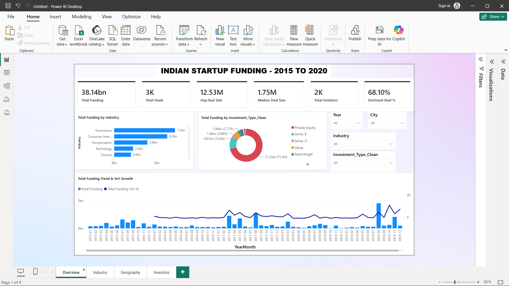
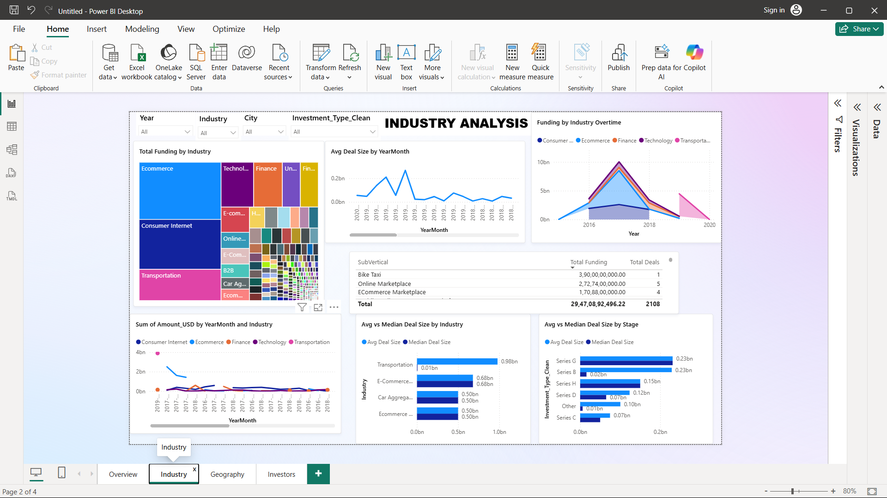
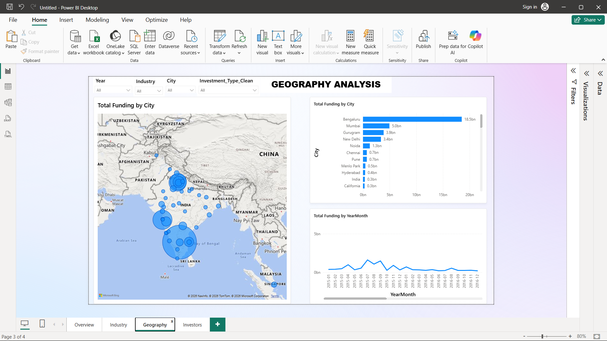
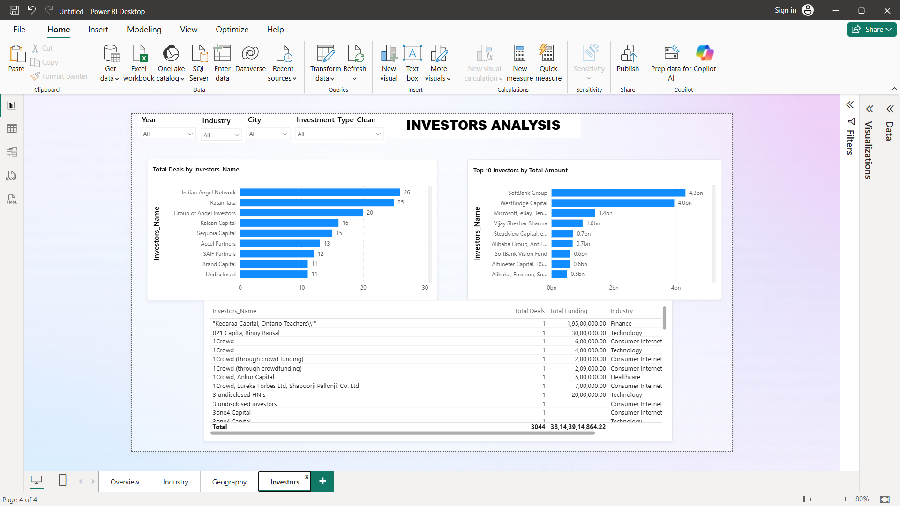

# Indian Startup Funding Analysis (2015 to 2020)

An end to end data analytics project on Indian startup funding activity between 2015 and 2020. The project moves from raw, messy data through cleaning, SQL analysis, and an interactive dashboard, ending in a set of written insights.

## Problem Statement

Analyze Indian startup funding data from 2015 to 2020 to uncover trends in investment activity, looking at which industries, cities, and funding stages attracted the most capital over time, and who the key investors were.

Six questions guided the analysis:

1. How has total funding trended over time, both in deal count and dollar amount, month over month and year over year?
2. Which industries received the most funding, and how has that shifted over time?
3. Which cities are the biggest startup hubs by funding volume?
4. How is funding distributed across funding stages, from Seed and Series A through B, C, and beyond, up to Private Equity and Debt?
5. Who are the top investors, by number of deals and by total amount invested?
6. What is the average and median deal size, and how does it vary by industry or stage?

The full problem statement is in [`problem_statement/problem_statement.pdf`](./problem_statement/problem_statement.pdf).

## Project Structure

```
datasets/
    raw_startup_funding.csv
    cleaned_startup_funding.csv

python/
    startup_funding_cleaning.ipynb

sql/
    startup_funding_analysis.sql
    sql_queries.pdf

dashboard/
    dashboard.pbix
    screenshots/
        01_overview.png
        02_industry.png
        03_geography.png
        04_investors.png

insights/
    indian_startup_funding_analysis.pdf

problem_statement/
    problem_statement.pdf

README.md
```

## Datasets

Raw data: [Indian Startup Funding](https://www.kaggle.com/datasets/sudalairajkumar/indian-startup-funding/suggestions) ,  3,044 startup funding records from 2015 to 2020, exported in its original form with the usual problems that come with real world data.

Cleaned data: `cleaned_startup_funding.csv`, the same 3,044 records after cleaning, ready for SQL and Power BI.

Columns in the cleaned file: `Date, Startup_Name, Industry, SubVertical, City, Investors_Name, Investment_Type, Amount_USD, Year, Month, YearMonth, Investment_Type_Clean`

## Python Cleaning Script

The raw file had several issues that needed fixing before any analysis could be trusted. The cleaning steps are documented in `startup_funding_cleaning.ipynb` and summarized below.

| Column | Problem in raw data | Fix applied |
|---|---|---|
| Date | Text values with eight different malformed formats, including missing separators, stray dots, and doubled slashes | Parsed into a proper date type, with zero unparseable rows left |
| Amount_USD | Text using Indian style digit grouping, plus the literal word "undisclosed" in some rows | Converted to a numeric field, missing values left as null rather than zero so they do not distort averages |
| City | 112 raw variants, including typos and multi city entries | Standardized to a single canonical name per city |
| Investment_Type | Around 55 near duplicate labels for the same handful of funding stages | Collapsed into about 17 clean categories, stored in Investment_Type_Clean |
| Investors_Name | 63 groups of case and spacing variants, including SoftBank spread across three or more spellings | Normalized to the most frequent spelling, with SoftBank aliases merged into a single SoftBank Group entry |
| Text columns generally | Leftover encoding artifacts from a bad export, including stray escape sequences and literal newline characters | Stripped and normalized |
| Remarks, Sr No | Low value columns, Remarks was 86 percent empty | Dropped |
| Missing categorical fields | Nulls in Industry, SubVertical, City, Investors_Name | Filled with "Unknown" so grouping operations do not silently drop rows |

One detail worth calling out. Merging the SoftBank name variants revealed a true total of roughly 6.55 billion dollars that had been hidden across fragments under different spellings. This is a good example of why the cleaning step matters before drawing any conclusions from the data.

## SQL Queries

All six core questions, plus several extra analytical queries, were answered in MySQL using aggregations, window functions such as RANK and LAG, and ranked common table expressions for median calculations.

Queries are in `sql/startup_funding_analysis.sql`. Each query alongside its output is documented in `sql/SQL_QUERIES.pdf`.

Extra queries beyond the six core questions:

- Overall disclosed versus undisclosed deal percentage
- Top 10 largest single funding rounds
- Startups that raised more than one round, with total amount raised
- Top subverticals by funding within the top five industries
- City and industry combined, top 15 pairs by funding
- Number of unique investors and unique startups per year

## Dashboard

A four page interactive Power BI dashboard, built on the cleaned dataset. The file is at `dashboard/dashboard.pbix`. All four pages share Year, City, Industry, and Investment Type filters for cross filtering.

### Overview

Headline numbers, funding by industry, funding by investment type, and the monthly funding trend with year over year growth.



### Industry

Funding by industry over time, average versus median deal size comparisons, and a subvertical breakdown.



### Geography

A city level funding map, ranked cities by total funding, and the funding trend by month.



### Investors

Top investors by deal count and by total amount invested, plus the full investor level table.



## Insights

The full write up, with charts and commentary for each of the six questions, is in `insights/Indian_Startup_Funding_Analysis.pdf`.

Headline numbers:

- Total funding tracked: 38.14 billion dollars across 3,044 deals
- Average deal size: 18.40 million dollars, median deal size: 1.75 million dollars
- 2,364 unique investors
- 68.1 percent of deals disclosed a funding amount

Key findings:

Funding is concentrated, not spread out. One city, Bengaluru, one stage, Private Equity, and two industries, Ecommerce and Consumer Internet, account for a disproportionate share of total capital. Bengaluru alone drew about 18.5 billion dollars, nearly four times Mumbai, the next largest hub. Private Equity rounds made up 71.4 percent of all funding despite representing a small share of total deals.

The average deal size is misleading on its own. The median of 1.75 million dollars is a far better picture of what a typical funding round looks like. The average of 18.40 million dollars is pulled upward by a small number of very large rounds. Transportation shows the widest gap between the two, with a 979 million dollar average against a 6.5 million dollar median.

Investors tend to fall into two different groups. Angel networks and individual investors, such as Indian Angel Network and Ratan Tata, appear frequently and write many smaller checks. Institutional investors, such as SoftBank Group and WestBridge Capital, appear far less often but write much larger checks. There is very little overlap between the two groups.

## Limitations

About 32 percent of records have no disclosed funding amount, so totals in this analysis reflect only the disclosed portion. The true market size is likely larger.

The dataset only runs through January 2020, so that year is incomplete and should not be compared directly against the full years before it.

Some industry and subvertical labels required judgment calls during cleaning, since the original labels were inconsistent in the raw data.

## Tech Stack

| Stage | Tool |
|---|---|
| Data cleaning | Python, pandas |
| Analysis | MySQL |
| Visualization | Power BI |
| Documentation | PDF |

## Author

Jeet Makhija

LinkedIn: [https://www.linkedin.com/in/jeet-makhija/]
